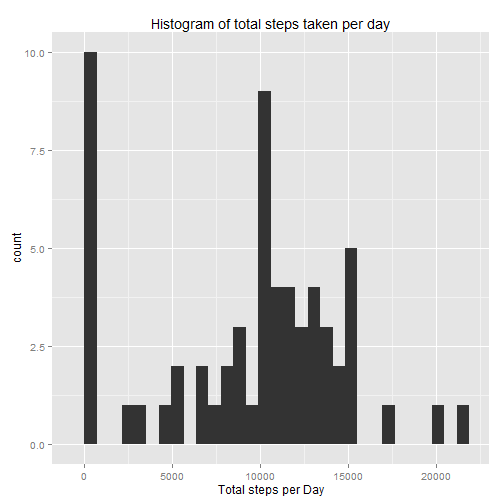
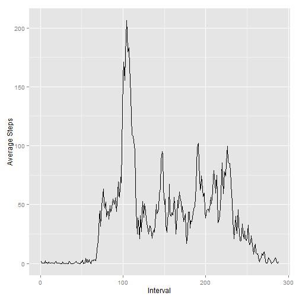
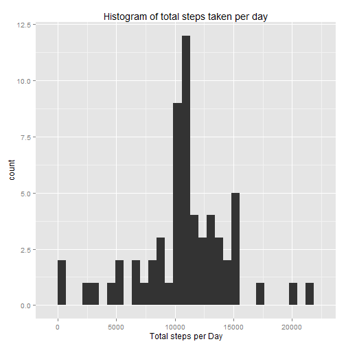
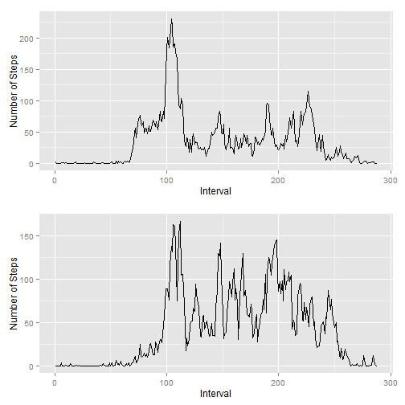

# Reproducible Research: Peer Assessment 1


## Loading and preprocessing the data

```r
data <- read.csv("activity.csv")
data <- transform(data, interval = factor(interval), date = as.Date(date, ,'%Y-%m-%d'))
```


## What is mean total number of steps taken per day?

```r
library(ggplot2)
qplot(tapply(data$steps,data$date,sum,na.rm=T), xlab = "Total steps per Day", main = "Histogram of total steps taken per day")
```

 

```r
# calculate median and mean
mean <- round(mean(tapply(data$steps,data$date,sum,na.rm=T)), digits = 2)
median <- round(median(tapply(data$steps,data$date,sum,na.rm=T)), digits = 2)
```

###Mean and median of steps per each day : 
Mean steps per Day : **9354.23**

Median steps per Day : **1.0395 &times; 10<sup>4</sup>**


## What is the average daily activity pattern?

```r
library(ggplot2)
IntervalFrame = data.frame(interval = as.numeric(unique(data$interval)), average = tapply(data$steps,data$interval,mean,na.rm=T))
g <- ggplot(IntervalFrame, aes(x =interval, y = average))
g + geom_line() + labs(x = "Interval", y = "Average Steps")
```

 

```r
# find which interval has the max value of steps
max.steps <-max(tapply(data$steps,data$interval,mean,na.rm=T))
max.interval <- which(tapply(data$steps,data$interval,mean,na.rm=T) %in% 
          max.steps)
```
**the interval that has the maximum value of steps 206.17 is 104**

## Imputing missing values
There are **2304** *NA* values in the existing dataset

to fill the missing values, I subsitute the missing values with the average for the interval from the original table.

```r
# create a new copy of the data set with non missing values
newData <- data
newSteps <- as.vector(tapply(newData$steps,newData$interval,mean,na.rm=T)[newData[is.na(newData$steps),]$interval])
newData[is.na(newData$steps),]$steps <- newSteps

# plot the histogram
library(ggplot2)
qplot(tapply(newData$steps,newData$date,sum,na.rm=T), xlab = "Total steps per Day", main = "Histogram of total steps taken per day")
```

 

```r
# calculate the new median and mean
mean <- round(mean(tapply(newData$steps,data$date,sum,na.rm=T)), digits = 2)
median <- round(median(tapply(newData$steps,data$date,sum,na.rm=T)), digits = 2)
```
**the new Data is very different from the previous data, data looks much more normally distributed**

### New Mean and median of steps per each day : 
Mean steps per Day : **1.0766 &times; 10<sup>4</sup>**

Median steps per Day : **1.0766 &times; 10<sup>4</sup>**


## Are there differences in activity patterns between weekdays and weekends?

```r
## create new factor with two levels weekday, weekend
days <- weekdays(as.Date(newData$date,"%Y-%m-%d"))
days[days=='dimanche' | days == 'samedi'] <- 'weekend'
days[days!='weekend'] <- 'weekday'
newData <- cbind(newData, days)
## make a panel plot
library(ggplot2)
library(gridExtra)
meanPerDay <- tapply(newData$steps,list(newData$interval,newData$days),mean)
IntervalFrame = data.frame(interval = as.numeric(unique(newData$interval)), average = tapply(newData$steps,list(newData$interval,newData$days),mean))
g1 <- ggplot(IntervalFrame, aes(x =interval, y = average.weekday)) + geom_line()  + labs(x = "Interval", y = "Number of Steps", main = "WeekDays")
g2 <- ggplot(IntervalFrame, aes(x =interval, y = average.weekend)) + geom_line()  + labs(x = "Interval", y = "Number of Steps", main = "weekend")
grid.arrange(g1, g2)
```

 

